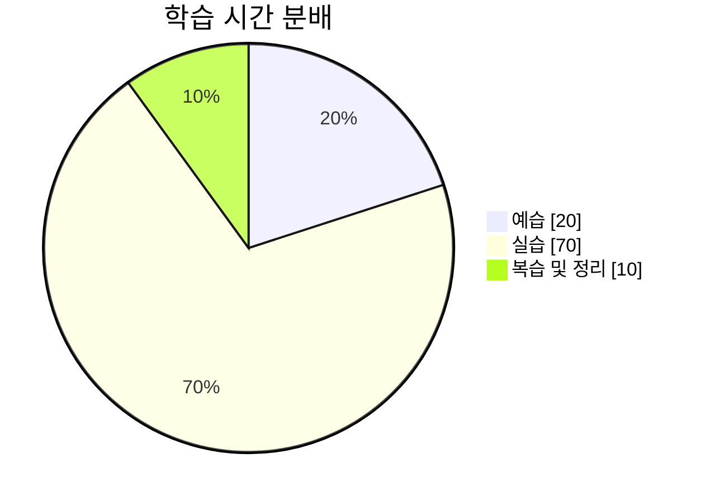

# 3주차 학습 회고

## 🙆‍♀️ Keep (잘한 점 & 유지할 것)

- **배경(동작 원리, 변화 과정)부터 학습**하며 큰 그림을 그린 후 수업에 참여하니, 속성과 강사님의 설명이 훨씬 명확하게 와닿았다. 
- **핵심 개념 정리/copilot & 노트 작성** 
  → 이번주는 실습 위주의 수업이 많다고 판단되어 지난주처럼 모든 수업 내용을 정리하지 않고 copilot의 도움을 받아 키워드 위주로 정리 후 회고시간에 디테일한 개념을 서로 체크 해주는 시간을 가지고나니 이해하는데 속도가 붙었다.
- **이틀에 한번 규칙적인 운동 습관 형성** 
  → 첫 주 시작 때보다 적은 시간을 들였지만 시원하게 근육을 풀 수 있었고, 아침 수업에 가장 집중이 잘 되었던 경험을 했다. 

---

## 💪 Problem (어려웠던 점 & 개선할 점)

- **_이론과 현실의 괴리_**\
  → 이론은 이해가 되지만 적용하는 조건과 경우의 수를 시뮬레이션 돌린 경험이 많지 않으니 익숙 않다고 느꼈다.
- **_효율적인 시간관리 필요_**\
  → 이번주는 실습도 많지만 그 만큼 이론도 적지 않았다. 우선순위 없이 닥치는 것만 하다 보니 겉핥기 식의 공부가 되는게 아닌가 반성한다. 
- **_모르는 개념에 대한 충분하지 않은 대처_**  
  → 익숙하지 않은 개념과 배경 설명이 후다닥 지나가는 경우 메모를 할 세가 없어 메모를 전혀 하지 못하고 손을 놔버리는 상황 발생. (물론 눈으로는 보고 이해를 우선으로 따라감) 마음이 좋지 않았다. 

---

### ⏳ 시간 사용 분석

---

## 😼 Try (다음 주 시도할 것 & 개선 방향)

1. 이론과 현실의 괴리 극복
> - 특정 개념을 학습한 후, 3~5개의 실용적인 사용 사례를 떠올려 코드로 직접 구현해보기
>
💡 예를 들어, CSS flexbox를 학습했다면, 다양한 flex-direction, align-items, justify-content 조합을 시도해보기.

2. 효율적인 시간 관리 필요
> - 가장 중요한 3가지" 원칙 도입

하루의 학습 목표 중 가장 중요한 3가지 개념/기능을 선정하여 먼저 깊이 있게 학습한다. 나머지는 필요할 때 참고할 수 있도록 quick wrap up 하기.
> - 80/20 법칙

전체 수업 내용 중 핵심 20%가 전체 개념의 80%를 차지한다.  
→ 가장 자주 쓰이는 개념에 초점 맞추기.

3. 모르는 개념을 효과적으로 기록하는 방법 찾기
> - "기록보다 마킹" 전략

❓(모름), ⭐(중요), 🤨(추가 학습 필요) 같은 심볼을 사용하여 수업 중 놓치는 부분을 빠르게 마킹. 이후 복습할 때 마킹된 부분만 다시 찾아 정리.
> - 예습 → 빠른 개념 확인 → 정리 패턴 반복

수업 전 web.dev, MDN에서 개념을 한 번 훑어보고 들어가기.
이미 본 개념이면 더 빠르게 메모 가능, 모르는 개념이 나와도 당황하지 않고 요약할 수 있음.

\

