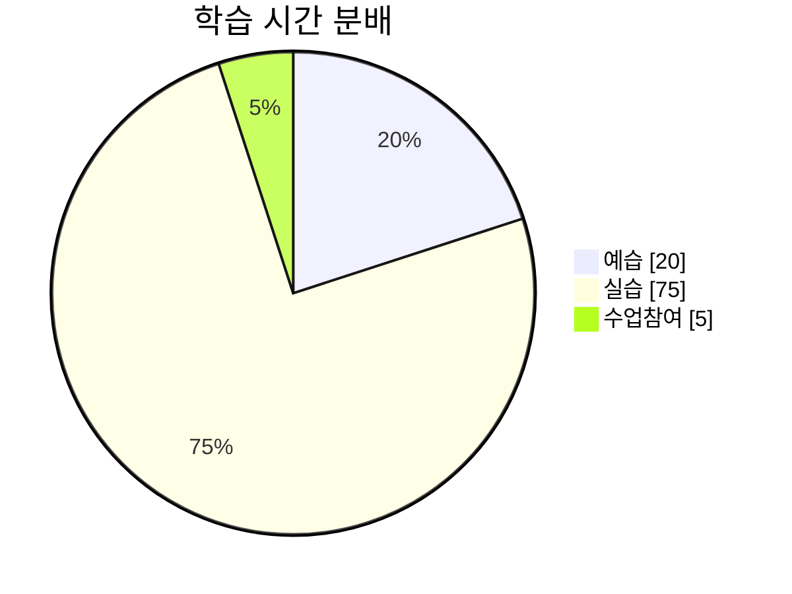

# 4주차 학습 회고

## 🙆‍♀️ Keep (잘한 점 & 유지할 것)

- **수업 직후 Quick Wrap-up 시도**  
  → 배운 내용에서 추가 실습이 필요한 부분을 구분하면서 이해도를 높였다.  

- **실습 중심의 회고 시간 운영**  
  → 단순 복습이 아닌 직접 실습하며 배운 내용을 적용하는 회고 시간 위주로 가졌고, 이를 통해 학습을 혼자 시작해보는데 좋은 시발점이 되었다.  

- **끝까지 수업을 듣고 회고 시간 적극 활용**  
  → 이해하려는 태도를 유지하며, 생소했던 논리구조 프로세스를 기록하며 수업 이해도를 높혔다.   

- **심볼 마킹 기법 활용**  
  → 수업 중 다시 공부해야 할 부분을 빠르게 체크하여, 복습할 때 우선순위를 정하기 용이했다.  

---

## 💪 Problem (어려웠던 점 & 개선할 점)

- **_개인 실습 부족으로 실무 적용 속도 저하_**  
  → 시안을 보고 직접 구현하는 시간이 예상보다 오래 걸리며, 수업 후반부에는 단순히 듣기만 하게 되었다. 

- **_깊이 있는 개념에서 집중력 저하_**  
  → 개념이 복잡해질수록 이해가 어려워지고, 집중력이 급격히 떨어지는 문제가 발생.  

- **_복습할 내용이 점점 쌓이고 있음_**  
  → 수업 중 체크한 학습 항목이 많아지면서 복습해야 할 내용이 점점 늘어나 부담이 커지고 있음.  

---

### ⏳ 시간 사용 분석

---

## 😼 Try (다음 주 시도할 것 & 개선 방향)

1. **개인 실습 부족 해결 → 실무 적용 속도 향상**
> - 실습 시간을 수업 시작 전,후 30분을 별도 확보하여 **하루 최소 60분 이상 개인 실습 진행**  

> - 시안을 보고 **최소 2가지 방식으로 구현해보며 비교 학습**  

> - 부족했던 실습을 보완하고, 배운 내용을 바탕으로 과제 다시 만들기  

2. **깊이 있는 개념에서 집중력 저하 해결** 
> - **미리 개념 확인 후 학습**  
>   - 강사님이 귀뜸해주신 예습 가이드 라인을 참고하여 web.dev, MDN을 통해 미리 훑어보고 수업에 참여하기.   

3. **복습할 내용이 쌓이는 문제 해결**
> - **"복습 리스트"를 우선순위별로 정리**  
>   - 중요도가 높은 내용부터 빠르게 확인하며, 시간이 부족할 경우 핵심 개념만 학습 (수업 중 심볼이 표시된 내용을 해당 리스트에 우선적으로 기재할 것.)

> - **모르는 개념을 기록하는 방식 개선**  
>   - 별도 요약 정리(블로깅)보다는 마킹을 우선하고, 복습할 때 필요한 부분만 다시 찾아보기. 

---

## 5주차 공부방향

✔ **실습 중심 학습이 효과적이므로 지속 유지**  
✔ **개인 실습 부족 문제 해결을 위해(9시 취침) 새벽(2~5시) 시간을 활용한 연습 강화**  
✔ **깊이 있는 개념에서 집중력이 떨어지는 문제는 빠른 요약 & 실습과 팀회고 시간, 질의응답 확인을 통해 극복**  
✔ **복습 부담을 줄이기 위해 복습 리스트를 체계적으로 정리하고, 필요할 때 다시 찾아보는 방식으로 전환**  

**"듣기 → 정리 → 실습"을 빠르게 반복하며, 개념을 몸에 익히는 것이 핵심!**
필요하면 계속 조정하며 더 나은 학습법을 찾아가자.화이팅!! 💪😊

\

