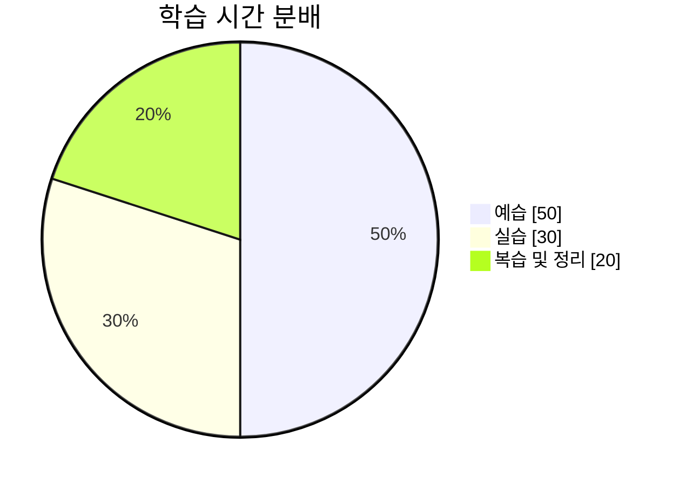

# 1,2주차 학습 상태를 회고하며..

## 🙆‍♀️ Keep (잘한 점 & 유지할 것)
+ ***매일 꾸준히 학습한 습관 유지***  
  → 하루 일정 시간 이상 학습하는 리듬이 생겨서 뿌듯했다.  
+ ***핵심 개념 정리 & 노트 작성*** 
  → 학습한 내용을 키워드 위주로 정리 후 회고시간에 깊이 있게 알아가니 스스로 공부하는 방향이 생겼다.   
+ ***질문하는 습관*** 
  → 틀리거나 모르는 것은 빠르게 질문하고, 검색하며 해결하는 과정에 배움의 힘이 생겼다.  

> ❣️ 질문하는 습관을 들이려고 노력한 점이 가장 큰 성장 포인트라고 생각이 든다! 자세히 보기

> ---
> 자세히 보기: 학습이 깊어질수록 유저와의 상호작용이 더욱 중요하다는 것을 깨달았다. 이를 뒷받침하는 탄탄한 기초를 쌓기 위해서는 충분한 실습이 필수적이라고 생각한다. 
---

## 💪 Problem (어려웠던 점 & 개선할 점)
- ***시간 관리 문제***\
  → 특정 개념에 너무 깊이 빠져서 계획보다 학습 시간이 지체된다.   
- ***이론보다 실습 부족***\
  → 개념을 이해한 것 같지만, 실습하는 시간 확보가 적어 제대로 된 복습이 어려웠다.   
- ***에러 해결 능력 부족***  
  → 문제가 발생했을 때 원인을 빠르게 파악하는 능력이 아직 부족하다.  

### ⏳ 시간 사용 분석

***

## 😼 Try (다음 주 시도할 것 & 개선 방향)

|        개선할 점     |                해결 방법                |
|:-----------------: | :-----------------------------------: |
|       시간 관리      |     학습 목표를 세분화하고 타임 트래킹 진행     |
|    이론 + 실습 병행   |  Wrap-up 후 질문과 공부 방향을 메모장에 기록   |
|     에러 연습 강화    |   자주 발생하는 오류를 기록하고 해결책 정리      |
| 코드 리뷰 & 피드백 받기 |  CLI 기본 명령어 정리 후 연습용 디렉토리 제작   |

\

